## Portfolio

---

### Semantic Analysis of Amazon Customer Reviews Using NLP
Customer reviews have become a cornerstone for consumer decision-making. In this project I used Natural Language Processing (NLP), to detect the customer's sentimental value of the product. This involves handling raw dataset and parsing it into a dataframe, NLP processess such as lemmatization and using WordClouds to observe what customers are saying for a certain product. 

  
   

[View Code on Colab](https://colab.research.google.com/drive/1fTI68pxkJyydkzL9ix2HFqkUyjhI7Mv1?usp=sharing)

---

### The Business of Eating: Forecasting Trends in Victoria's Food Industry

  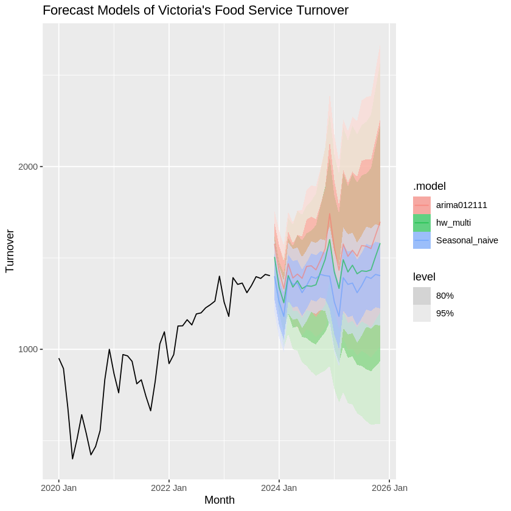
  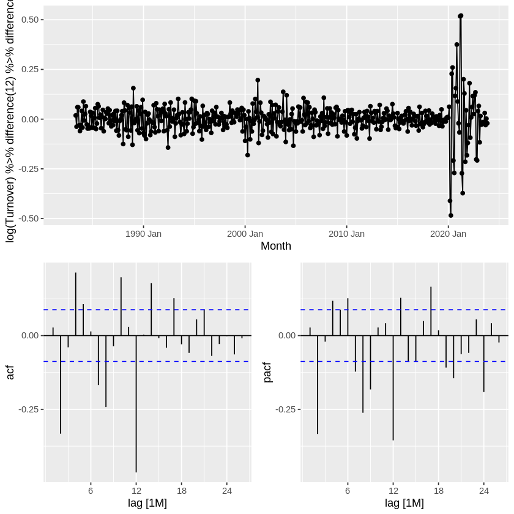
  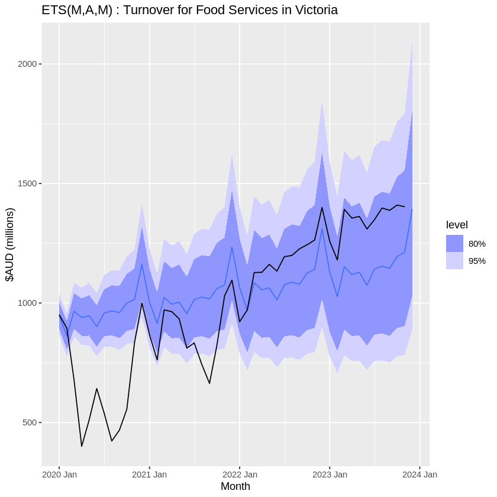

[View Code on Colab](https://colab.research.google.com/drive/1LRFjsoKpLBRtxFh6nExfkQcSz_GM0KHl?usp=sharing)

---

### Predicting Autism in Children using Decision Trees

  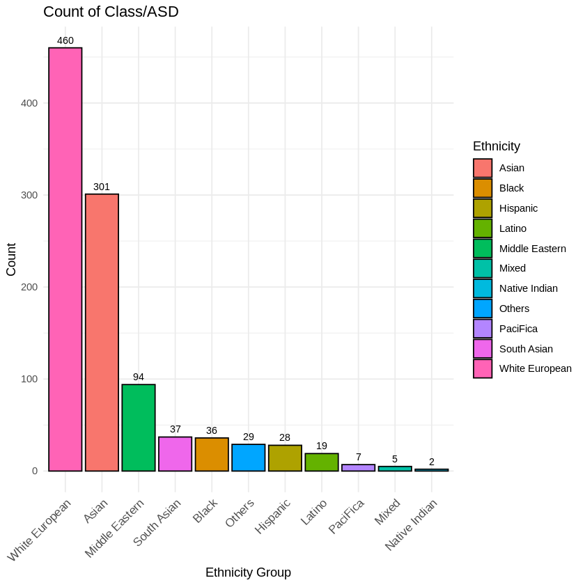
  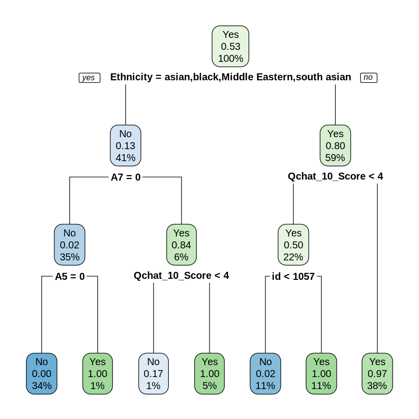 

[View Code on Colab](https://colab.research.google.com/drive/1rb8jteWVyb2elwHAeDdrGXMfFHXKfUBO?usp=sharing)

### Coffee Quality Analysis through Logistic Regression
[View code on Colab]()

  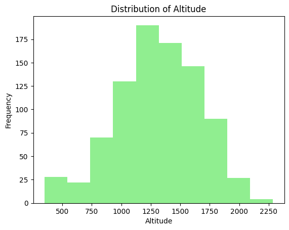
  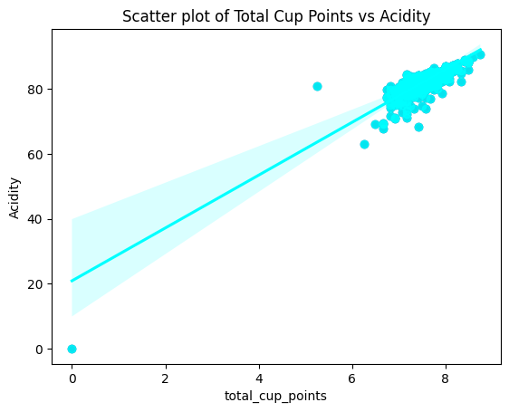

### Heart Failure Prediction Using KNN, Decision Trees, and Support Vector Machines
[View Code on Colab](https://colab.research.google.com/drive/1-i9iOU26G-RsD1Yn5TEjz5NIvrweUOIo?usp=sharing)

  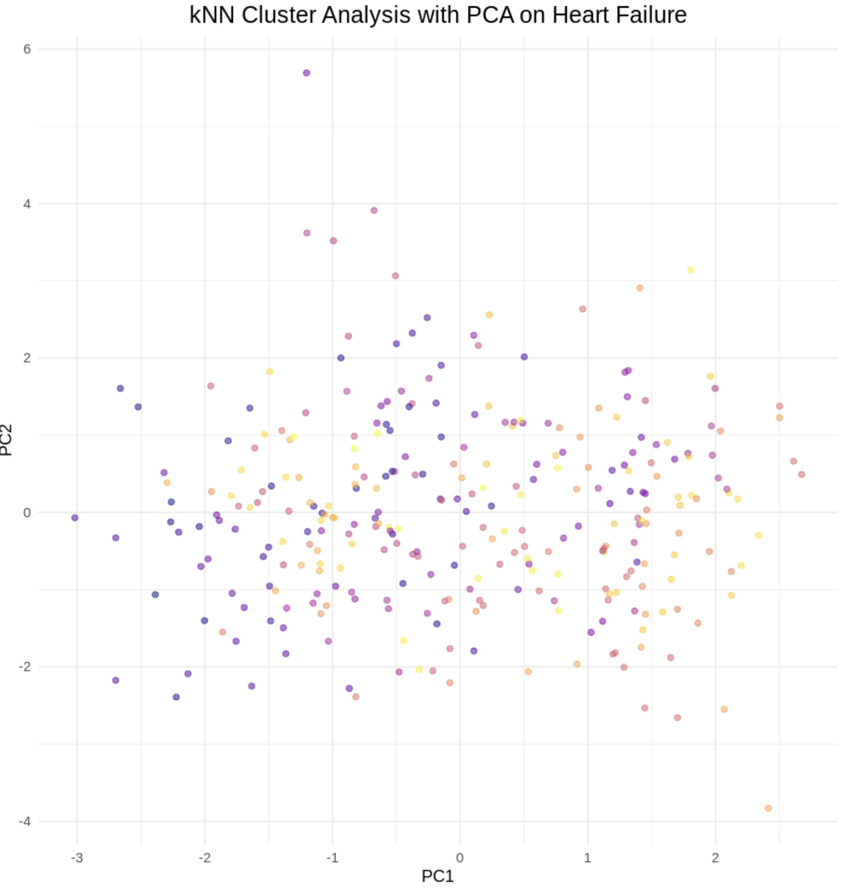
  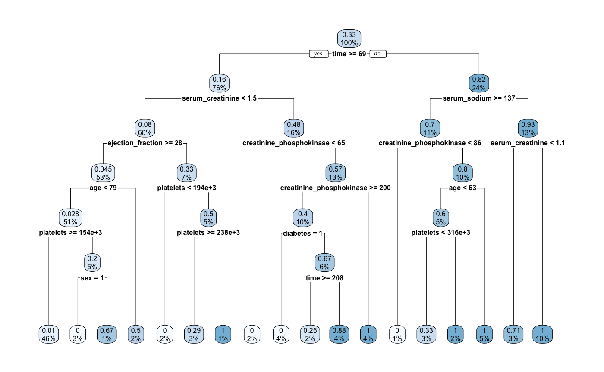
  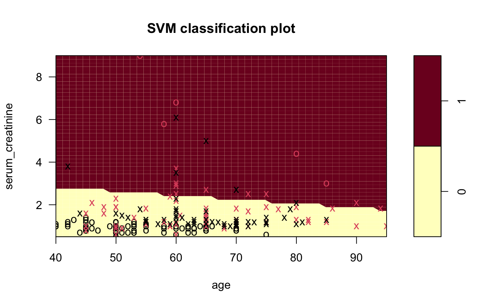 

### Exploring the Structure of US Income Inequality Through Dimensionality Reduction
[View Code on Colab](https://colab.research.google.com/drive/1oaAbkFeCLZrftQxKQbltCcsUBzpjpm6L?usp=sharing)

  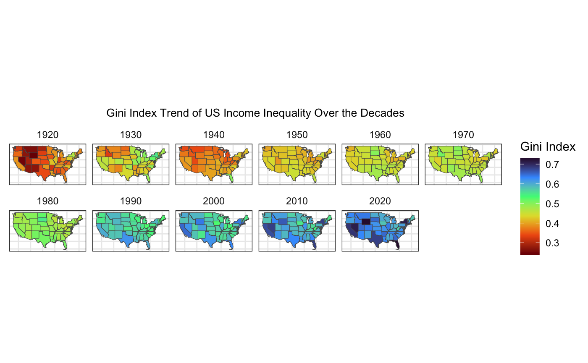
  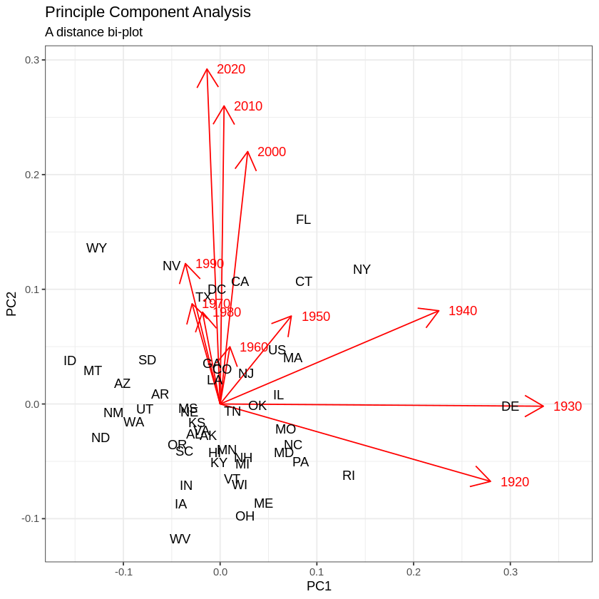
   

<!-- 
- [Project 1 Title](http://example.com/)
- [Project 2 Title](http://example.com/)
- [Project 3 Title](http://example.com/)
- [Project 4 Title](http://example.com/)
- [Project 5 Title](http://example.com/)
-->

---

---

Page template forked from <a href="https://github.com/evanca/quick-portfolio">evanca</a>

<!-- Remove above link if you don't want to attibute -->
