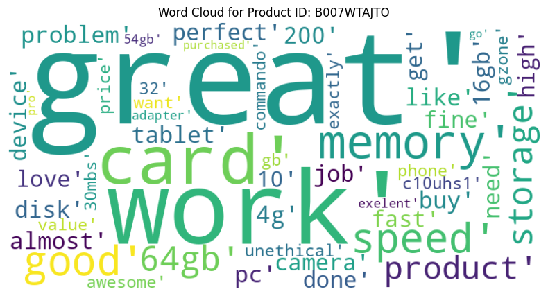
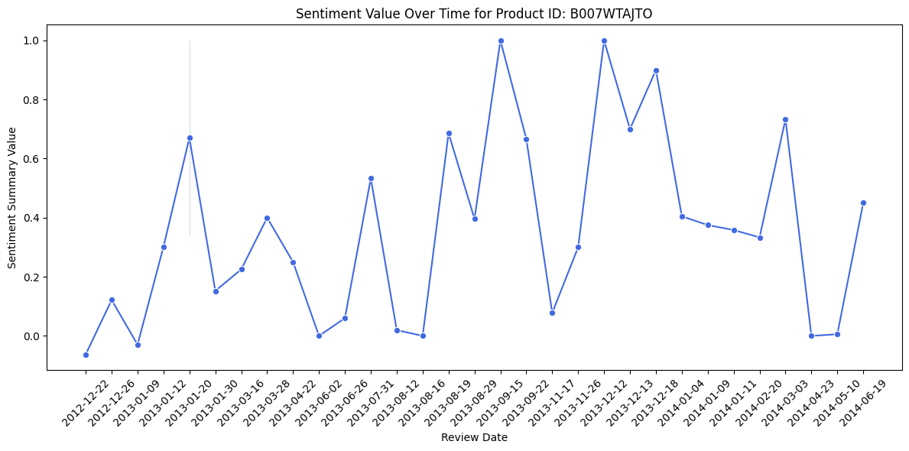

## Portfolio

---

### Semantic Analysis of Amazon Customer Reviews Using NLP

[Semantic Analysis of Amazon Customer Reviews Using NLP](https://colab.research.google.com/drive/1fTI68pxkJyydkzL9ix2HFqkUyjhI7Mv1?usp=sharing)

  
   

---
[Project 2 Title](/pdf/sample_presentation.pdf)
[View Rmarkdown here]

---
[Project 3 Title](http://example.com/)

---

### Category Name 2

- [Project 1 Title](http://example.com/)
- [Project 2 Title](http://example.com/)
- [Project 3 Title](http://example.com/)
- [Project 4 Title](http://example.com/)
- [Project 5 Title](http://example.com/)

---

---

Page template forked from <a href="https://github.com/evanca/quick-portfolio">evanca</a>

<!-- Remove above link if you don't want to attibute -->
