## Data Science Portfolio: Showcasing Analytics, Wrangling, and Machine Learning Models

---
###  Data Professionals Survey Analysis & Visualization
This Power BI dashboard presents insights from a survey of 630 data professionals, analyzing demographics, job roles, salary trends, and workplace satisfaction. It highlights average salaries across different job titles, the popularity of programming languages like Python and R, and breaks down perceptions of job difficulty. The dashboard also visualizes key happiness metrics, including work-life balance and salary satisfaction, through interactive gauges and charts. With intuitive visuals such as treemaps, bar plots, and donut charts, this project showcases my ability to transform raw survey data into clear, actionable insights using Power BI.

[View dashboard in Git](https://github.com/kevtr0801/kevtr0801.github.io/tree/master/dashboards)

  

---

###  Pokémon Team Recommender Build 

This project is a data-driven Pokémon Team Recommender built using unsupervised learning clustering techniques to help players discover synergistic and diverse team options. The system groups Pokémon based on shared attributes such as types, stats, abilities, and evolution families, then recommends suitable team members that either complement or match a selected Pokémon's characteristics.

[View Website](https://pokemon-team-recommendation-system.onrender.com/) \
[View Code on Git](https://github.com/kevtr0801/pokemon_team_recommendation_system)

  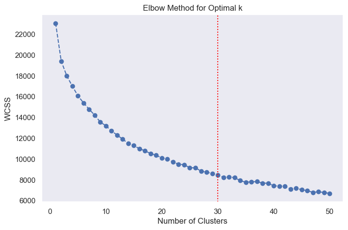
  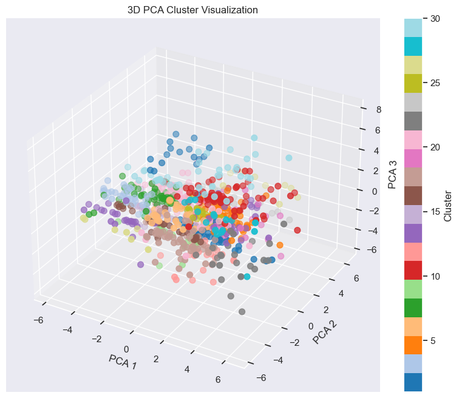 
  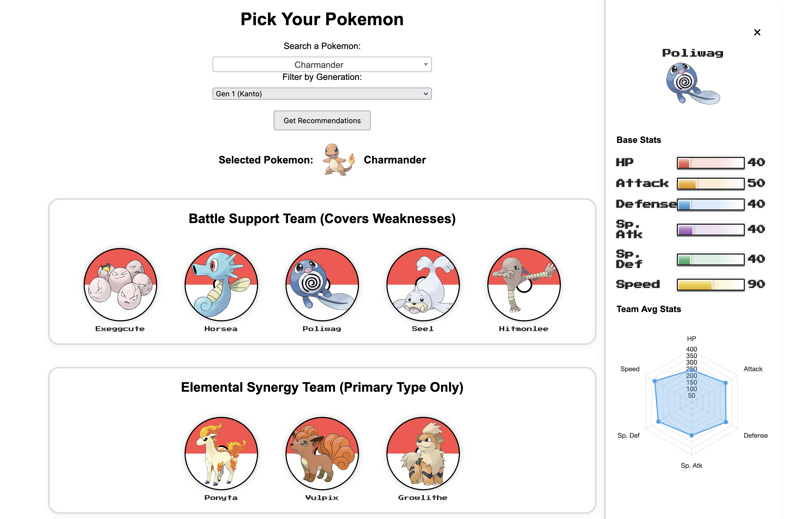

---
###  Applying Machine Learning to Diagnose Spinal Disorders

This project applies supervised machine learning to classify vertebral column conditions—Normal, Disk Hernia, and Spondylolisthesis—based on six biomechanical spinal measurements. Using data from the UCI repository, the pipeline covers exploratory analysis, preprocessing, model training, hyperparameter tuning, and ensemble methods. The final Hard Voting Classifier, deployed via Streamlit, achieved 90.32% accuracy and offers a robust tool for diagnostic prediction.

[View Website](https://predicting-vertebral-column-outcomes-2.onrender.com/) \
[View Code on Git](https://github.com/kevtr0801/predicting-vertebral-column-outcomes)

  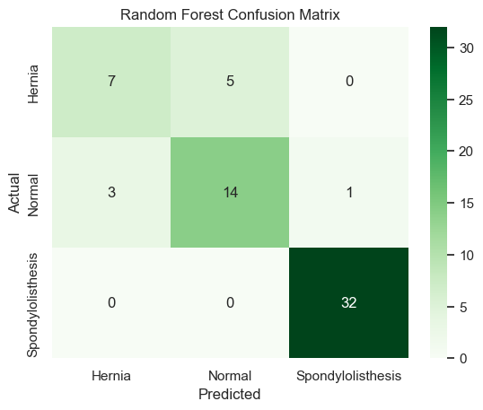 
  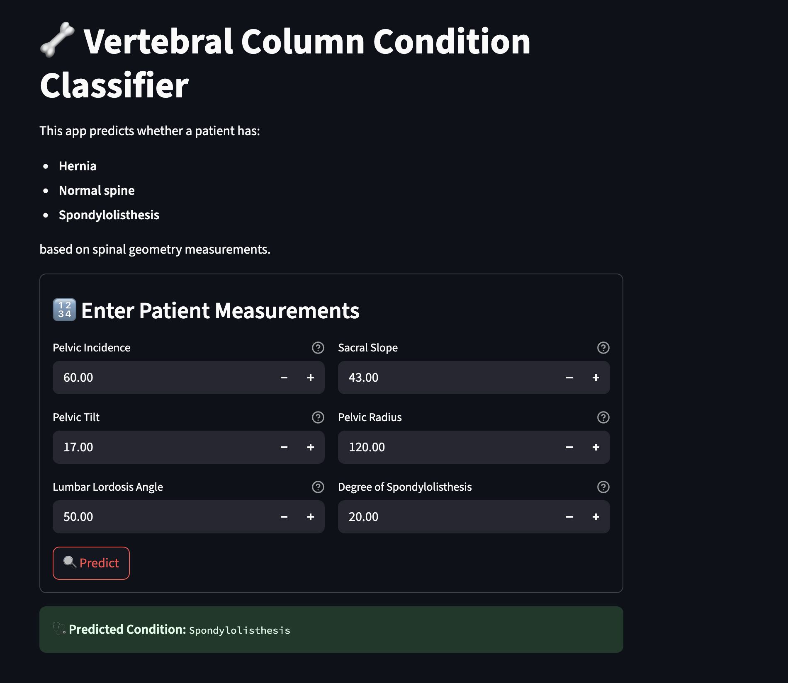

---

###  Understanding Japan’s Heart Attack Crisis
This dashboard summarises heart attack occurrences in Japan, showing key averages (e.g., heart rate, BMI, blood pressure) and visualising how heart attacks vary by age, gender, region, health metrics, and lifestyle factors like physical activity, diet, and alcohol consumption.

[View dashboard in Tableau](https://public.tableau.com/app/profile/kevin.tran7345/viz/heart-attack-v3-final/Final)

  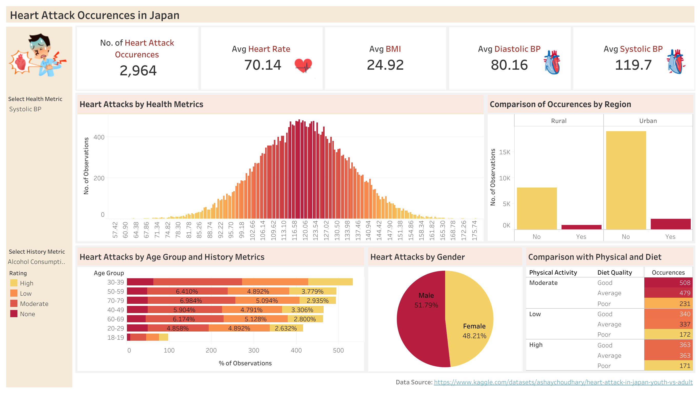

---

###  Decoding Customer Sentiments: An NLP Approach of Analysing Amazon Customer Reviews
Customer reviews have become a cornerstone for consumer decision-making. In this project I used Natural Language Processing (NLP), to detect the customer's sentimental value of the products they reviewed. This involves handling the raw dataset and parsing it into a dataframe, NLP processess such as lemmatization and tokenization, and using WordClouds to observe what customers are saying for certain products. 

[View Code on Colab](https://colab.research.google.com/drive/1fTI68pxkJyydkzL9ix2HFqkUyjhI7Mv1?usp=sharing)

  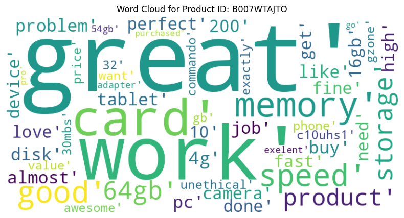
  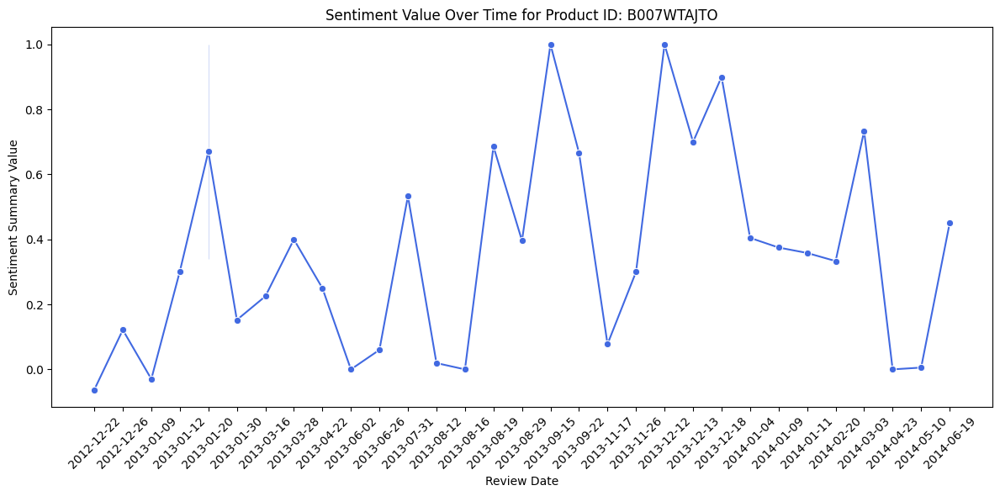 

---

###  The Business of Eating: Forecasting Trends in Victoria's Food Industry
This project focuses on forecasting the future of food service turnovers in Victoria Australia. I will be using Seasonal Naive, Exponential Smoothing (ETS) and AutoRegressive Integrated Moving Average (ARIMA) forecasting models to provide a comprehensive outlook on the movement in food service turnovers.

[View Code on Rmarkdown](https://github.com/kevtr0801/kevtr0801.github.io/blob/master/pdf/food-turnover-project.pdf)

  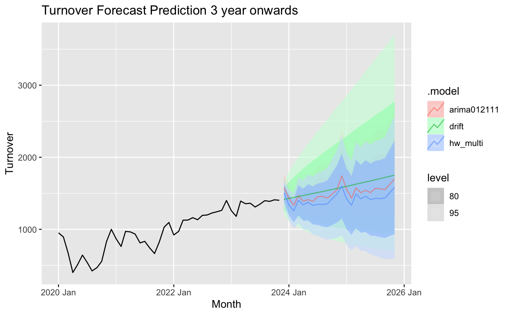

---

###   Machine Learning for the Heart: Comparing kNN, Decision Trees, and SVM in Predicting Heart Failure
This small project focuses on predicting heart failure risk using machine learning algorithms. Heart failure is a complex clinical syndrome with high morbidity and mortality rates. Early detection and timely intervention can significantly improve patient prognosis. Therefore I hope this project harnesses the power of data science to aid in such early detection by analyzing clinical data through three distinct machine learning models: k-Nearest Neighbors (kNN), Decision Trees, and Support Vector Machines (SVM).

[View Code on Colab](https://colab.research.google.com/drive/1-i9iOU26G-RsD1Yn5TEjz5NIvrweUOIo?usp=sharing)

  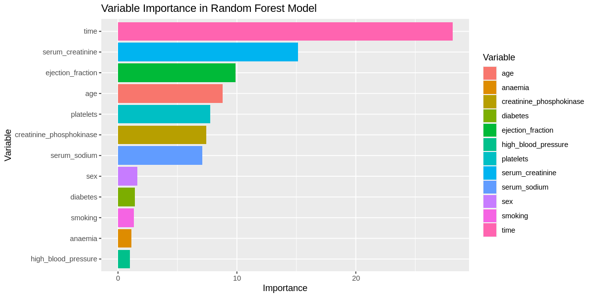
  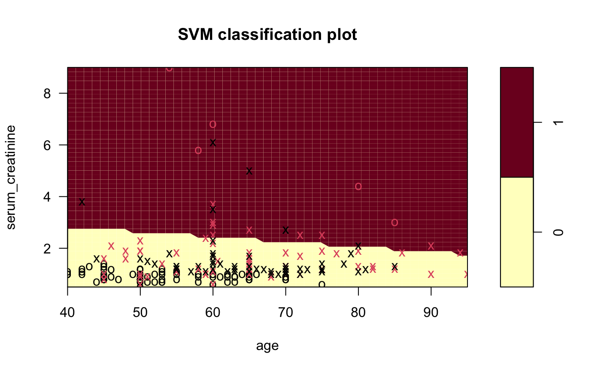 
  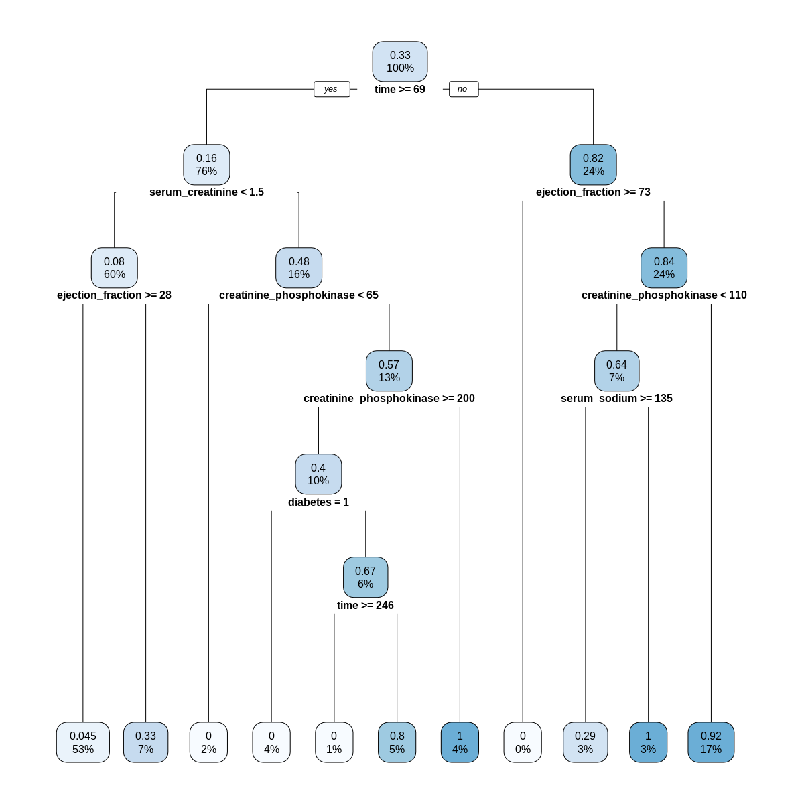

---

###  Regression & Regularization on Student Math Scores

This notebook explores the relationships between various factors affecting student's math scores during exams, and evaluates how well these relationships can be used to predict future outcomes. To achieve these objectives, I conducted two separate regression analyses:

1. Exploratory Regression Analysis: Investigating the relationships between variables to understand the key factors affecting student performance with hypothesis testing.

2. Predictive Regression Analysis: Building regression models trained on a subset of the data and evaluating using test data to assets its predictive capability on student math scores. Regularization methods are also considered.

[View Code on Kaggle](https://www.kaggle.com/code/kooploop/regression-regularization-on-student-math-scores)

  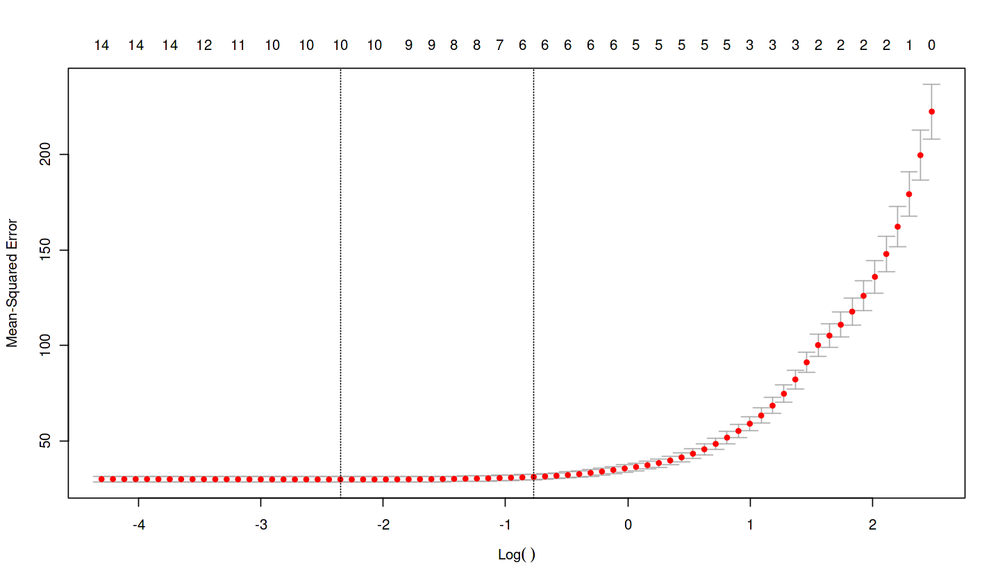
  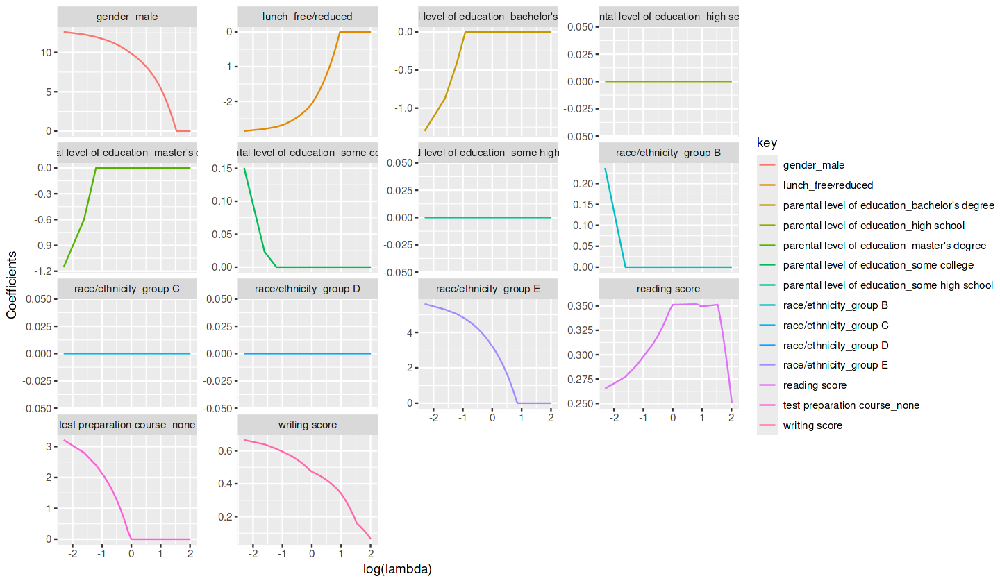 

---
<!-- 

### Predicting Autism in Children using Decision Trees

  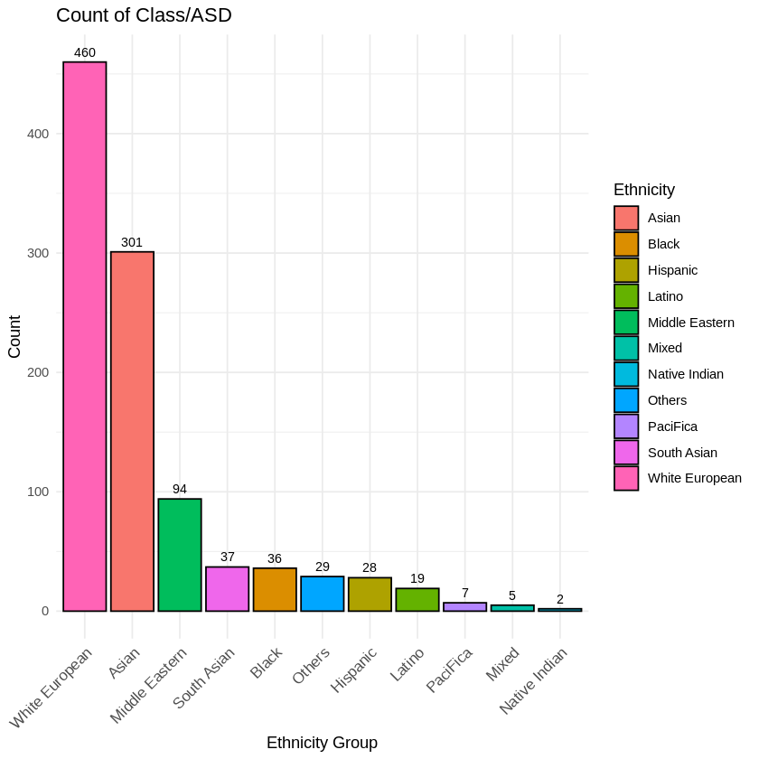
  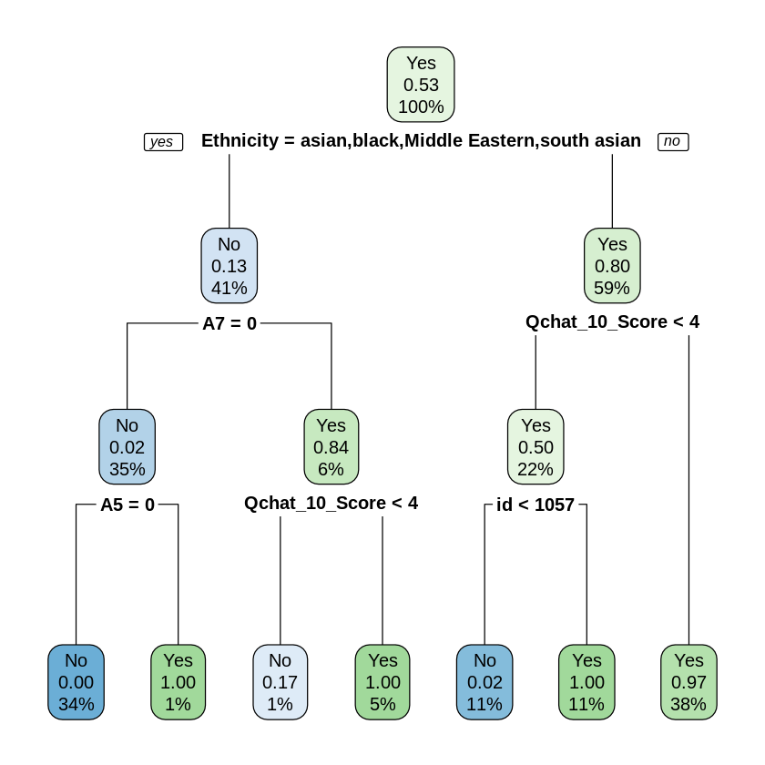 

[View Code on Colab](https://colab.research.google.com/drive/1rb8jteWVyb2elwHAeDdrGXMfFHXKfUBO?usp=sharing)

---

### Exploring the Structure of US Income Inequality Through Dimensionality Reduction
[View Code on Colab](https://colab.research.google.com/drive/1oaAbkFeCLZrftQxKQbltCcsUBzpjpm6L?usp=sharing)

  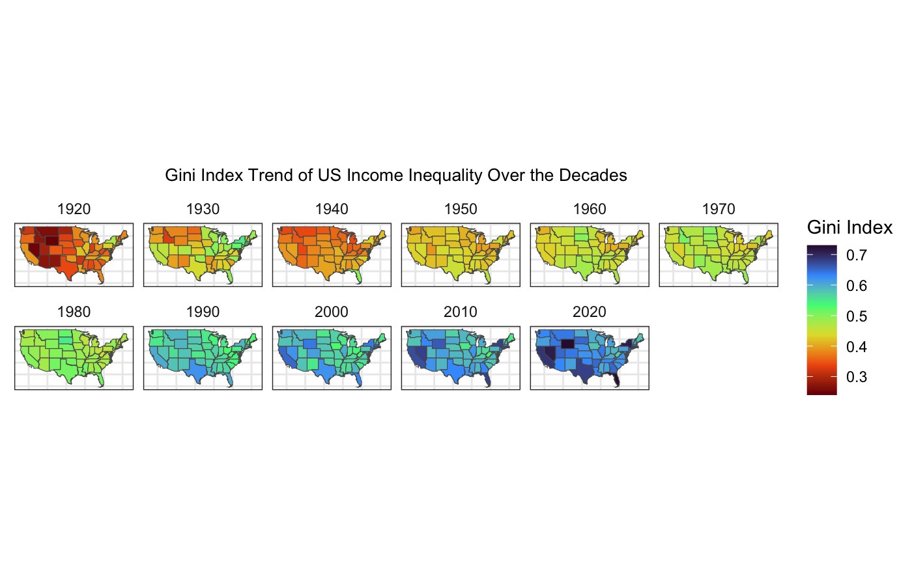
  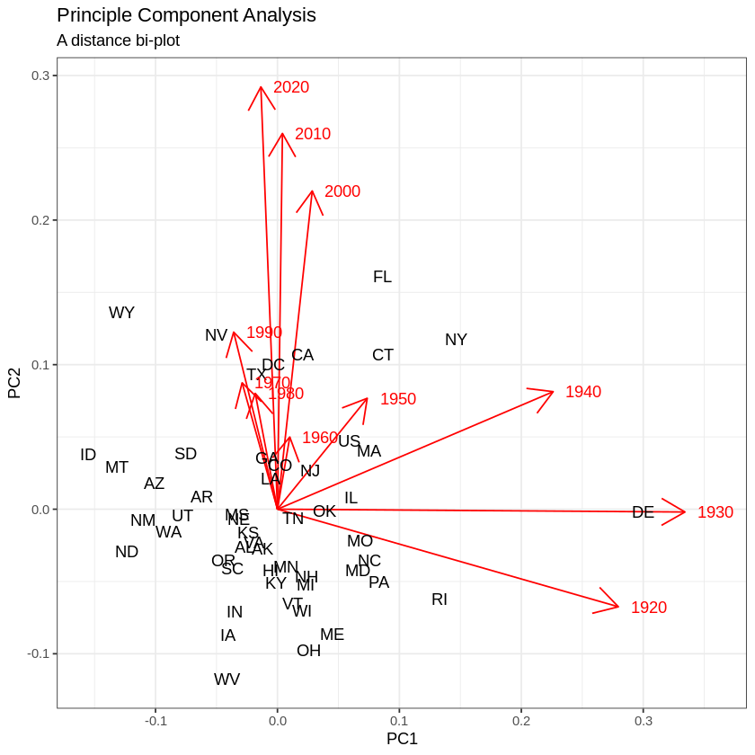
  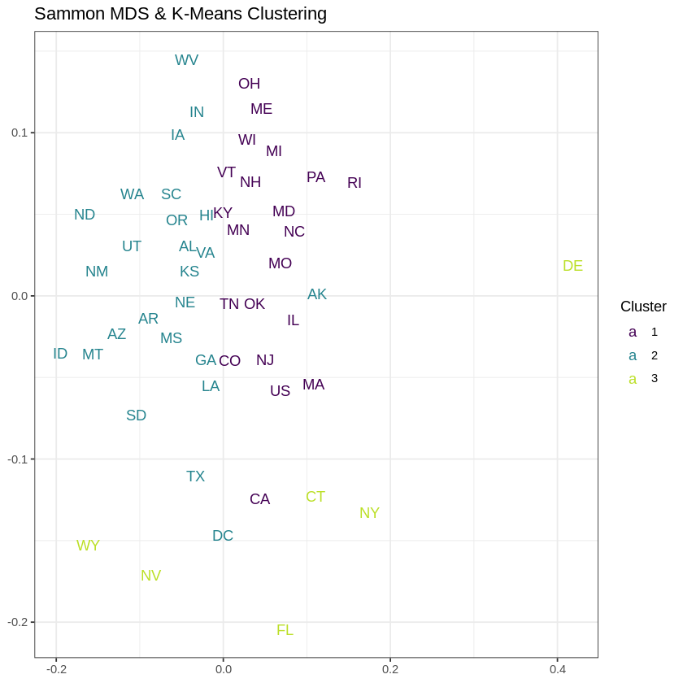 

## Portfolio

---

### Semantic Analysis of Amazon Customer Reviews Using NLP

Customer reviews have become a cornerstone for consumer decision-making. In this project, I used Natural Language Processing (NLP) to detect the customer's sentimental value of the product. This involves handling raw datasets and parsing them into a dataframe, NLP processes such as lemmatization, and using WordClouds to observe what customers are saying for a certain product.

 

*Fig.1: Word Cloud of Customer Reviews & Fig.2: Time Series Analysis of Sentiment Over Time*

[View Code on Colab](https://colab.research.google.com/drive/1fTI68pxkJyydkzL9ix2HFqkUyjhI7Mv1?usp=sharing)

    

---

- [Project 1 Title](http://example.com/)
- [Project 2 Title](http://example.com/)
- [Project 3 Title](http://example.com/)
- [Project 4 Title](http://example.com/)
- [Project 5 Title](http://example.com/)
-->
