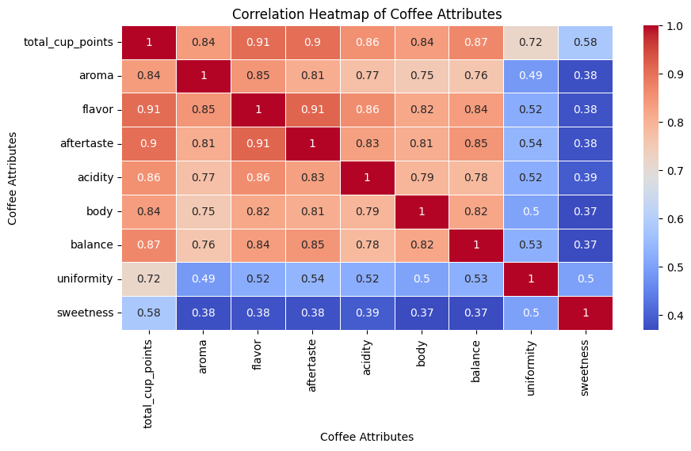
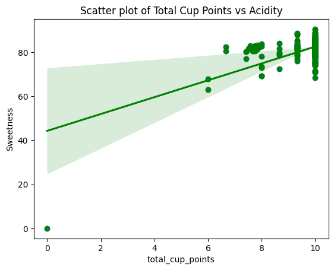

## Data Science Portfolio: Showcasing Analytics, Wrangling, and Machine Learning Models

<table style="width:100%">
  <tr>
    <td width="33%" valign="top">

<h3> Understanding Japan’s Heart Attack Crisis</h3>

This dashboard summarises heart attack occurrences in Japan, showing key averages (e.g., heart rate, BMI, blood pressure) and visualising how heart attacks vary by age, gender, region, health metrics, and lifestyle factors like physical activity, diet, and alcohol consumption.

<a href="https://public.tableau.com/app/profile/kevin.tran7345/viz/heart-attack-v3-final/Final">View dashboard in Tableau</a>

  

  
  
  

</td>

<td width="33%" valign="top">

<h3> Deciphering Coffee Excellence</h3>

Ever wondered what makes a coffee truly great? In this project, I dive into the data behind the brew by analysing aroma, flavour, sweetness, altitude, and acidity to uncover the what makes a coffee truly high quality using logistic regression models.

  
  

  
  
  
  
  
  

</td>

<td width="33%" valign="top">

<h3> The Business of Eating</h3>

This project embarks on an analytical journey to forecast the future of food service turnovers in Victoria Australia. I will be using Seasonal Naive, Exponential Smoothing (ETS) and ARIMA forecasting models.

<a href="https://github.com/kevtr0801/kevtr0801.github.io/blob/master/pdf/food-turnover-project.pdf">View Code on Rmarkdown</a>

  

  
  

</td>
</tr>

<tr>
<td width="33%" valign="top">

<h3> Machine Learning for the Heart</h3>

This small project focuses on predicting heart failure risk using machine learning algorithms. I compare k-Nearest Neighbors (kNN), Decision Trees, and SVM.

  
   
  

  
  
  
  
  

</td>

<td width="33%" valign="top">

<h3> Decoding Customer Sentiments</h3>

In this project I used Natural Language Processing (NLP) to analyze Amazon customer reviews using lemmatization, tokenization, and WordClouds.

  
   

  
  
  
  
  

</td>

<td width="33%" valign="top">

<h3> Regression on Student Math Scores</h3>

This notebook explores the relationship between various factors affecting students’ math scores using regression and regularization.

<a href="https://www.kaggle.com/code/kooploop/regression-regularization-on-student-math-scores">View Code on Kaggle</a>

  
   

  

</td>
</tr>
</table>

