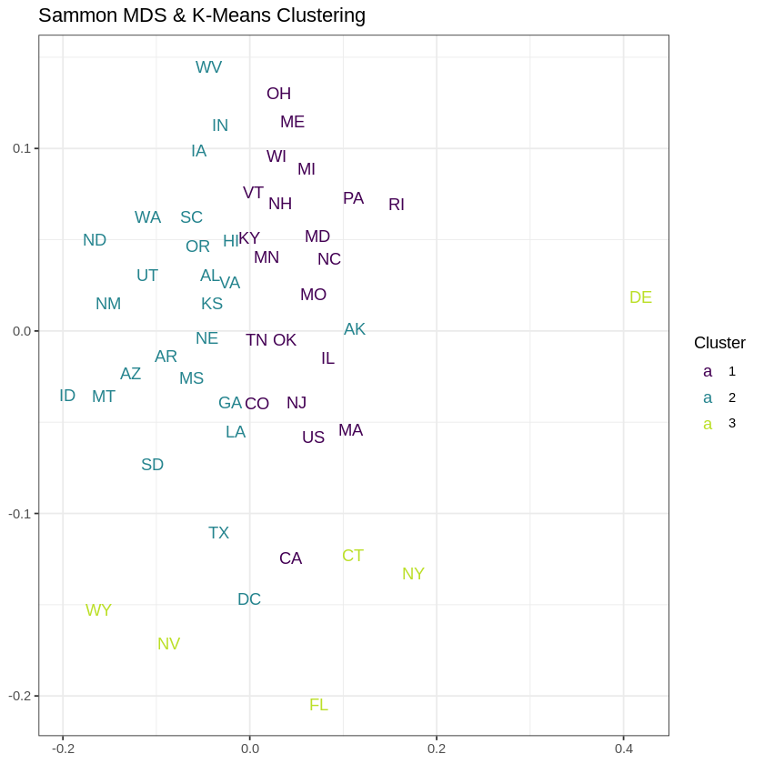

## Data Science Portfolio: Showcasing Analytics, Wrangling, and Machine Learning Models

---
###  Coffee Quality Analysis through Logistic Regression 

Ever wondered what makes a coffee truly great? In this project, we dive into the data behind the brew, analyzing aroma, flavor, sweetness, altitude, and acidity to uncover the secrets of high-quality coffee. Using logistic regression, we'll sift through the beans and the buzz to predict what sets apart the best cups from the rest. Prior to applying logistic regresion, a couple of columns are cleaned and visualised to give us an insight about the coffee dataset.

[View code on Colab](https://colab.research.google.com/drive/17e4CyHPjsensGdyJDm25B32ND1vI2wDo?usp=sharing)

  
  

---

###  The Business of Eating: Forecasting Trends in Victoria's Food Industry
This project embarks on an analytical journey to forecast the future of food service turnovers in Victoria Australia. I will be using Seasonal Naive, Exponential Smoothing (ETS) and AutoRegressive Integrated Moving Average (ARIMA) forecasting models to provide a comprehensive outlook onthe movement in food service turnovers.

[View Code on Rmarkdown](https://github.com/kevtr0801/kevtr0801.github.io/blob/master/pdf/food-turnover-project.pdf)

  

---

###   Heart Failure Prediction Using KNN, Decision Trees, and Support Vector Machines
This small project focuses on predicting heart failure risk using machine learning algorithms. Heart failure is a complex clinical syndrome with high morbidity and mortality rates. Early detection and timely intervention can significantly improve patient prognosis. Therefore I hope this project harnesses the power of data science to aid in such early detection by analyzing clinical data through three distinct machine learning models: K-Nearest Neighbors (KNN), Decision Trees, and Support Vector Machines (SVM).

[View Code on Colab](https://colab.research.google.com/drive/1-i9iOU26G-RsD1Yn5TEjz5NIvrweUOIo?usp=sharing)

  
   
    

---

###  Semantic Analysis of Amazon Customer Reviews Using NLP
Customer reviews have become a cornerstone for consumer decision-making. In this project I used Natural Language Processing (NLP), to detect the customer's sentimental value of the product. This involves handling raw dataset and parsing it into a dataframe, NLP processess such as lemmatization and using WordClouds to observe what customers are saying for a certain product. 

[View Code on Colab](https://colab.research.google.com/drive/1fTI68pxkJyydkzL9ix2HFqkUyjhI7Mv1?usp=sharing)

  
   

---
<!-- 

### Predicting Autism in Children using Decision Trees

  
   

[View Code on Colab](https://colab.research.google.com/drive/1rb8jteWVyb2elwHAeDdrGXMfFHXKfUBO?usp=sharing)

---

### Exploring the Structure of US Income Inequality Through Dimensionality Reduction
[View Code on Colab](https://colab.research.google.com/drive/1oaAbkFeCLZrftQxKQbltCcsUBzpjpm6L?usp=sharing)

  
  
   

## Portfolio

---

### Semantic Analysis of Amazon Customer Reviews Using NLP

Customer reviews have become a cornerstone for consumer decision-making. In this project, I used Natural Language Processing (NLP) to detect the customer's sentimental value of the product. This involves handling raw datasets and parsing them into a dataframe, NLP processes such as lemmatization, and using WordClouds to observe what customers are saying for a certain product.

 

*Fig.1: Word Cloud of Customer Reviews & Fig.2: Time Series Analysis of Sentiment Over Time*

[View Code on Colab](https://colab.research.google.com/drive/1fTI68pxkJyydkzL9ix2HFqkUyjhI7Mv1?usp=sharing)

    

---

- [Project 1 Title](http://example.com/)
- [Project 2 Title](http://example.com/)
- [Project 3 Title](http://example.com/)
- [Project 4 Title](http://example.com/)
- [Project 5 Title](http://example.com/)
-->
